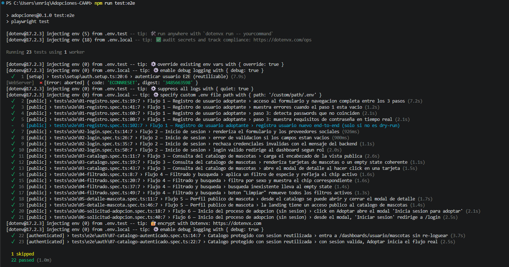

# CAAM — Suite de Pruebas E2E con Playwright

Suite de pruebas End-to-End para el sistema **CAAM (Centro de Atención Animal de Morelia)**, una plataforma web desarrollada con **Next.js 15, TypeScript y Supabase** para la gestión de adopciones de mascotas, citas, documentación y seguimiento post-adopción.

El objetivo de esta suite es validar de forma automatizada los flujos más importantes del sistema desde la perspectiva de un usuario real, garantizando la calidad, estabilidad y correcto funcionamiento de la aplicación.

---

# Integrantes del equipo

* Jose Antonio Medina Ayala
* Cesar Enrique Diaz Maldonado
* Enrique Martinez
* Paulo Cesar Perez Martinez

---

# Herramienta utilizada

## Playwright

La automatización fue desarrollada utilizando **Playwright** (`@playwright/test`), una herramienta moderna para pruebas End-to-End que permite interactuar con navegadores reales mediante una API robusta y confiable.

### Razones de la elección

* Compatibilidad con Chromium, Firefox y WebKit.
* Esperas automáticas (*auto-waiting*) que reducen pruebas inestables.
* Generación automática de evidencias (capturas, videos y trazas).
* Reportes HTML interactivos.
* Excelente integración con proyectos desarrollados en TypeScript.
* Configuración sencilla para ejecución local y entornos CI/CD.

---

# Estructura del proyecto de pruebas

```text
.
├── playwright.config.ts
├── .env.test
├── tests/
│   ├── e2e/
│   │   ├── 01-registro.spec.ts
│   │   ├── 02-login.spec.ts
│   │   ├── 03-catalogo.spec.ts
│   │   ├── 04-filtrado.spec.ts
│   │   ├── 05-detalle-mascota.spec.ts
│   │   ├── 06-solicitud-adopcion.spec.ts
│   │   └── auth/
│   │       └── 07-catalogo-autenticado.spec.ts
│   ├── pages/
│   │   ├── RegistroPage.ts
│   │   ├── LoginPage.ts
│   │   └── CatalogoPage.ts
│   └── helpers/
│       ├── data.ts
│       └── env.ts
├── playwright-report/
└── test-results/
```

### Patrones de diseño utilizados

* Page Object Model (POM).
* Reutilización de componentes y helpers.
* Datos dinámicos para evitar colisiones entre ejecuciones.
* Reutilización de sesiones autenticadas mediante `storageState`.
* Aislamiento de pruebas mediante encabezados HTTP únicos para evitar problemas con el rate limiter.
* Ejecución condicional mediante `test.skip`.

---

# Requisitos previos

Antes de ejecutar las pruebas es necesario contar con:

* Node.js 18 o superior.
* npm.
* Proyecto CAAM funcionando localmente.
* Base de datos y servicios necesarios configurados.
* Navegadores de Playwright instalados.

---

# Instalación

## 1. Instalar dependencias

```bash
npm install
```

## 2. Instalar navegadores de Playwright

```bash
npm run test:e2e:install
```

---

# Configuración del entorno

Antes de ejecutar cualquier prueba es necesario crear un archivo llamado `.env.test` en la raíz del proyecto.

Este archivo contiene la configuración utilizada durante la ejecución de la suite y no debe subirse al repositorio.

### Windows (PowerShell)

```powershell
New-Item .env.test -ItemType File
```

### Linux / macOS

```bash
touch .env.test
```

### Configuración mínima

```env
E2E_BASE_URL=http://localhost:3000
E2E_PORT=3000

E2E_USER_EMAIL=
E2E_USER_PASSWORD=

E2E_REGISTER_DRY_RUN=1
```

### Descripción de variables

| Variable             | Descripción                                                |
| -------------------- | ---------------------------------------------------------- |
| E2E_BASE_URL         | URL donde se ejecuta la aplicación                         |
| E2E_PORT             | Puerto utilizado por la aplicación                         |
| E2E_USER_EMAIL       | Usuario de prueba para escenarios autenticados             |
| E2E_USER_PASSWORD    | Contraseña del usuario de prueba                           |
| E2E_REGISTER_DRY_RUN | Si vale 1, evita crear usuarios reales durante las pruebas |

> Se recomienda mantener `E2E_REGISTER_DRY_RUN=1` para evitar generar registros reales durante las pruebas de registro.

---

# Ejecución de las pruebas

| Comando                   | Descripción                            |
| ------------------------- | -------------------------------------- |
| `npm run test:e2e`        | Ejecuta toda la suite                  |
| `npm run test:e2e:headed` | Ejecuta la suite con navegador visible |
| `npm run test:e2e:ui`     | Ejecuta Playwright UI Mode             |
| `npm run test:e2e:debug`  | Ejecución paso a paso para depuración  |
| `npm run test:e2e:report` | Abre el reporte HTML generado          |

### Ejemplos

```bash
npm run test:e2e
```

```bash
npm run test:e2e:headed
```

```bash
npm run test:e2e:ui
```

```bash
npm run test:e2e:report
```

---

# Descripción de los flujos automatizados

La suite implementa seis flujos principales que representan funcionalidades críticas del sistema CAAM.

---

## Flujo 1 — Registro de usuario adoptante

**Archivo:** `tests/e2e/01-registro.spec.ts`

Validaciones realizadas:

* Navegación completa entre los tres pasos del formulario.
* Validación de campos obligatorios.
* Verificación de coincidencia de contraseñas.
* Validación dinámica de requisitos de contraseña.
* Registro real de usuario cuando el modo Dry Run está deshabilitado.

---

## Flujo 2 — Inicio de sesión

**Archivo:** `tests/e2e/02-login.spec.ts`

Validaciones realizadas:

* Renderizado correcto del formulario.
* Visualización de proveedores OAuth.
* Validación de campos vacíos.
* Rechazo de credenciales incorrectas.
* Inicio de sesión exitoso y redirección según el rol del usuario.

---

## Flujo 3 — Consulta del catálogo de mascotas

**Archivo:** `tests/e2e/03-catalogo.spec.ts`

Validaciones realizadas:

* Carga correcta del catálogo público.
* Visualización de tarjetas de mascotas o estado vacío.
* Apertura del modal de detalle.
* Verificación de elementos de interacción disponibles para el usuario.

---

## Flujo 4 — Filtrado y búsqueda

**Archivo:** `tests/e2e/04-filtrado.spec.ts`

Validaciones realizadas:

* Filtrado por especie.
* Filtrado por sexo.
* Búsqueda textual.
* Visualización de estados vacíos.
* Limpieza de filtros activos.

---

## Flujo 5 — Perfil público de mascota

**Archivo:** `tests/e2e/05-detalle-mascota.spec.ts`

Validaciones realizadas:

* Apertura del modal de detalle.
* Verificación de información mostrada.
* Cierre correcto del modal.
* Navegación desde la landing principal hacia el catálogo.

---

## Flujo 6 — Inicio del proceso de adopción

**Archivo:** `tests/e2e/06-solicitud-adopcion.spec.ts`

Validaciones realizadas:

* Apertura del modal de autenticación para usuarios sin sesión.
* Navegación hacia la pantalla de inicio de sesión desde el modal.
* Inicio del flujo de adopción para usuarios autenticados.
* Validación de respuestas del sistema según el estado del usuario.

---

# Flujos autenticados adicionales

Además de los seis flujos principales, la suite incluye pruebas adicionales que reutilizan una sesión autenticada previamente generada.

**Archivo:** `tests/e2e/auth/07-catalogo-autenticado.spec.ts`

Validaciones realizadas:

* Acceso al catálogo protegido sin realizar login nuevamente.
* Reutilización correcta de la sesión almacenada.
* Inicio del flujo real de adopción con un usuario autenticado.
* Verificación de respuestas del sistema según el estado del perfil.

---

# Estrategia de datos de prueba

Para evitar conflictos entre ejecuciones consecutivas:

* Los usuarios de prueba son generados dinámicamente.
* Cada correo electrónico es único por ejecución.
* Cada CURP generada es única y cumple las validaciones del sistema.
* Se utiliza una contraseña válida para todos los escenarios.
* El modo Dry Run evita escribir registros reales en la base de datos durante las pruebas de registro.

---

# Cobertura funcional validada

La suite automatizada cubre los siguientes procesos:

* Registro de usuarios.
* Inicio de sesión.
* Navegación pública.
* Consulta de catálogo de mascotas.
* Búsqueda y filtrado.
* Visualización de detalles de mascotas.
* Protección de rutas autenticadas.
* Control de acceso por sesión.
* Inicio del proceso de adopción.
* Validación de flujos conectados al backend de la aplicación.
* Reutilización de sesiones autenticadas.

---

# Evidencia de ejecución



La ejecución fue realizada mediante el comando:

```bash
npm run test:e2e
```

## Resultados obtenidos

```text
Running 23 tests using 1 worker

✓ 22 passed
- 1 skipped

22 passed (1.0m)
```

La captura anterior muestra la ejecución completa de la suite E2E, incluyendo los seis flujos principales del sistema y los escenarios autenticados que reutilizan una sesión previamente generada.

## Resumen de resultados

| Métrica                     | Resultado  |
| --------------------------- | ---------- |
| Total de pruebas ejecutadas | 23         |
| Pruebas aprobadas           | 22         |
| Pruebas omitidas            | 1          |
| Pruebas fallidas            | 0          |
| Tiempo total de ejecución   | 1.0 minuto |

## Estado por flujo

| Flujo                                   | Resultado  |
| --------------------------------------- | ---------- |
| Registro de usuario                     | ✓ Aprobado |
| Inicio de sesión                        | ✓ Aprobado |
| Catálogo de mascotas                    | ✓ Aprobado |
| Filtrado y búsqueda                     | ✓ Aprobado |
| Perfil público de mascota               | ✓ Aprobado |
| Solicitud de adopción                   | ✓ Aprobado |
| Flujos autenticados reutilizando sesión | ✓ Aprobado |

## Caso omitido

La única prueba omitida fue:

```text
registra usuario nuevo end-to-end (solo si no es dry-run)
```

La omisión es intencional debido a la configuración:

```env
E2E_REGISTER_DRY_RUN=1
```

Esta configuración evita la creación de usuarios reales mientras se valida completamente el flujo de registro.

La ejecución finalizó sin pruebas fallidas, validando correctamente los flujos principales del sistema y los escenarios que requieren autenticación.

---

# Reportes y evidencias generadas

Playwright genera automáticamente:

* Reporte HTML interactivo.
* Capturas de pantalla en caso de error.
* Videos de ejecución.
* Archivos Trace para depuración avanzada.

### Ubicaciones

```text
playwright-report/
```

```text
test-results/
```

### Visualizar reporte

```bash
npm run test:e2e:report
```

---

# Conclusiones

La suite de pruebas End-to-End desarrollada para el sistema CAAM permite validar de forma automatizada los procesos más importantes de la aplicación desde la perspectiva del usuario final.

Durante la ejecución se obtuvieron **22 pruebas exitosas, 1 prueba omitida y 0 pruebas fallidas**, demostrando estabilidad en los procesos de autenticación, navegación, consulta de mascotas, filtrado y adopción.

La implementación basada en Playwright, Page Object Model, reutilización de sesiones autenticadas y generación automática de evidencias proporciona una solución mantenible, escalable y alineada con las buenas prácticas de pruebas de software.

---

# Posibles mejoras futuras

* Ejecución multiplataforma en Firefox y WebKit.
* Seed automático de datos de prueba.
* Automatización de flujos administrativos.
* Cobertura del seguimiento post-adopción.
* Cobertura de gestión de citas.

---

# Licencia

Proyecto desarrollado con fines académicos para la materia de Pruebas de Software.
